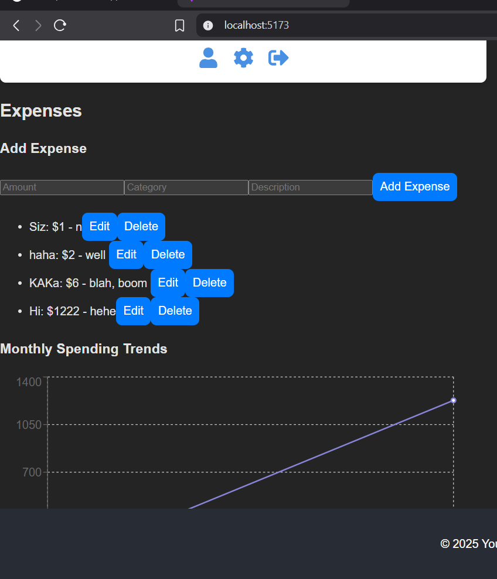

# Admin Dashboard

## Description
This project is an admin dashboard that includes functionalities for managing users, expenses, monthly trends, and budgets.

## Features
- User management
- Expense tracking
- Monthly trends
- Budget management

## Installation

To run the project locally, follow these steps:

### Backend
1. Navigate to the `backend` folder.
2. Install dependencies:
    ```bash
    npm install
    ```
3. Run the server:
    ```bash
    npm start
    ```

### Frontend
1. Navigate to the `frontend` folder.
2. Install dependencies:
    ```bash
    npm install
    ```
3. Run the frontend:
    ```bash
    npm start
    ```

## License
This project is licensed under the MIT License.

## Image

